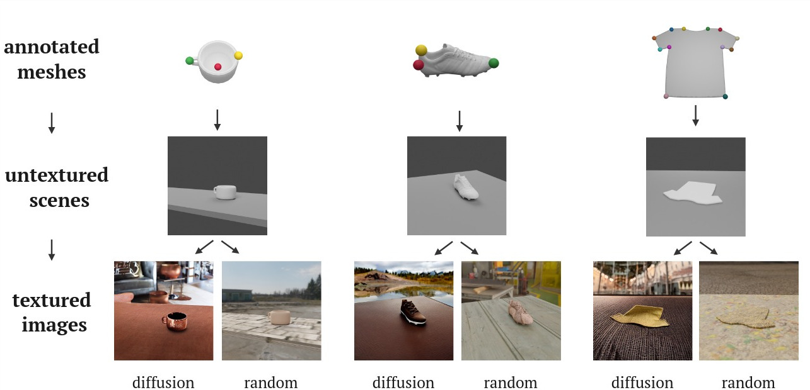

<h1 align="center">Evaluating Text-to-Image Diffusion Models for Texturing Synthetic Data </h1>


<p align="center">
  <a href="https://tlpss.github.io/">Thomas Lips</a>,
  <a href="https://airo.ugent.be/members/francis/">Francis wyffels</a>
  <br/>
  <a href="https://airo.ugent.be/">AI and Robotics Lab (AIRO) </a>,
  <a href="https://www.ugent.be/">Ghent University</a>
  <br/>
  <a href="https://arxiv.org/abs/2411.10164">paper </a>
<div align="center">
  
</div>
</p>


Codebase for the paper *Evaluating Text-to-Image Diffusion Models
for Texturing Synthetic Data*.

In this paper we generate synthetic data to learn representations for robotic manipulation, using the following three steps:

1. Gather meshes of the target object categories and annotate them.
2. Generate 3D scenes for the objects, for which we can then generate the annotations.
3. Use text-to-image diffusion models to texture images of the scenes, or use random textures.


The codebase covers all steps and can hence be used to generate synthetic data for your objects.
It also contains all code to run the experiments from the paper and can be used to reproduce them.

# Codebase Overview
```
.
├── airo-blender/                           # submodule with blender tooling
├── data/                                   # data directory stub
├── docker/                                 # docker image for the codebase
├── dsd/
│   ├── CVPRSyntaGen/                       # code for CVPR workshop submission
│   ├── dsd/                                # python package for texturing using diffusion models or random textures/
│   │   ├── image_metrics/                  # image-space metrics to evaluate synthetic datasets
│   │   ├── meshes/                         # pre-process and annotate meshes
│   │   └── rendering/                      # render images using Blender
│   ├── experiments/
│   │   ├── XX_<experiment>.py              # generate the synthetic datasets for a specific experiment
│   │   ├── train_keypoints_experiments.py  # train keypoint models on synthetic data
│   │   ├── train_keypoints.py              # train keypoint models on real datasets
│   │   ├── train_yolo_seg.py               # train segmentation models using YOLov8
│   │   ├── yolo_wandb_runs.py              # wandb runs for all yolo training runs
│   │   ├── keypoints_wandb_runs.py         # wand runs for all keypoint training runs
│   │   └── genreate_run_metrics.py         # generate the image metrics for all trained models
│   └── notebooks/                          # notebooks to explore texturing pipelines and diffusion models
├── keypoint-detection/                     # submodule to train keypoint detectors
└── visualisations/                         # create visualisations used in paper
```

[TOC created here](https://tree.nathanfriend.com/?s=(%27optNs!(%27fancy!true~fullPTh!false~trailingSlash!true~rootDot!true)~source!(%27source!%27airo-blqr2*4%22with%20blqAtooling3dTa2***40dTaUirectory%20stub3docker2***0dockeAz5foAth5codebas53dsd2***434CVPRSyntaGen240cod5foACVPR%20workshop%20submissN34dsd2***%23%20python%20packag5foAtexturEusEdiffusN7%20oArZom%20textures343*ze_metrics%2F****Kze-spac5metricHtWevaluT5Fsets3*meshes2*0pre-procesHZ%20annotT5meshes3*rqring2KrqAzeHusEBlqr34Is%2F3*XX_%3CI%3EJ*K%24FsetHfoAa%20specific%20I3*9_6s_Is.pyQF3*9_6sJ*QrealUTasets3*9_yolo_segJ*409%20segmentTN7%20usEYOLov83*yolo_wZb_jsJ*KwZb%20jMyolW9Ejs3*6s_wZb_jsJ0wZ%20jM6%209Ejs3*genreTe_j_metricsJ0cod5tW%24z5metriM9ed734notebooks2*KnotebookHtWexplor5texturEpipelineHZUiffusN7336-detectN2%22tW9%206Uetectors3%25s2*0creT5%25Hused%20in%20paper%27)~versN!%271%27)*440%20%23%202%2F*****3%5Cn4%20%205e%206keypoint7%20models9trainAr%20Eing%20FsyntheticUTaHs%20IexperimentJ.py**K%200MHfoAall%20NionQK9%2067%20on%20TatU%20dWo%20Zandjrunqendezimag%220submodul5%24generT5th5%25visualisTN%01%25%24%22zqjZWUTQNMKJIHFEA97654320*)
# Installation
<details>
<summary>expand here</summary>

## Local installation

- clone with submodules: `git clone <repo> --recurse-submodules`
- create conda env: `conda env create -f environment.yaml`
- add the diffusion dependencies: `conda env update -f diffusion-environment.yaml -n dsd`
-install & setup blender in airo-blender: from the airo-blender/blender folder, run `source ../bash_scripts/setup_blender.sh << path-to-your-conda-env`
- add blender to your path: from the `airo-blender/blender` folder, run `source add_blender_to_path.sh`

## Docker
A docker image is also available [here](docker pull tlpss/dsd:ral-v1). The image can be used to generate synthetic data from existing scenes. Rendering the scenes in Blender should be done upfront. This image was used to generate synthetic on the GPU Cluster.

</details>

# Generating Synthetic Data
<details>
<summary>expand here</summary>
</details>

## obtaining meshes
The first step is to gather a list of meshes and their keypoint annotations.

For the meshes, make sure they are oriented z-upwards and centered on the origin.
Examples for loading from [Objaverse](https://objaverse.allenai.org/) can be found [here](/dsd/dsd/meshes/get_objaverse_mugs.py).

Store them in `data/meshes/<category>`.


Then you need to annotate the meshes, specifying the 3D location of all keypoints. You can do this manually or you can write a small script that reasons on the 3D geometry. An example of the latter for shoes can be found [here](dsd/dsd/meshes/label_shoes.ipynb).

The annotations should be gathered in a json file with as name `<obj-filename>_keypoints.json` containing a dict of keypoints with a 3D location.

## Generating 3D scenes
Once the meshes are gathered and annotated, you can generate the 3D scenes and render the depth images required to texture the scene with a Controlnet.

Edit the configuration in the [render_scenes.py](dsd/dsd/rendering/render_scenes.py) and generate the images and blender scenes. You can also edit the scene composition and all other aspects [here](dsd/dsd/rendering/blender/renderer.py).

## Texturing the images using diffusion models

Use [this script](dsd/experiments/02_gemini_prompt_diffusion_renders.py) as example for how to texture the scenes and generate COCO-formatted datasets. To change the diffusion model that is used, see [here](dsd/dsd/diffusion_rendering.py). To use multi-stage texturing pipelines, see [here](dsd/dsd/three_stage_diffusion_rendering.py).


# Reproducing Paper
<details>
<summary>expand here</summary>

## Data

### Meshes
All meshes used for the three categories can be found [here](https://doi.org/10.5281/zenodo.14169206). you can extract this into the `data/` folder.

### Real-world images

The real-world train and test dataset for the T-shirts were taken from [this paper](https://ieeexplore.ieee.org/document/10538385). The images were cropped and resized to 512x512.

The datasets for the mugs and shoes were collected and labeled manually.

The datasets are available [here](https://doi.org/10.5281/zenodo.14169206).
## Trained Models
All model training runs were logged using [wandb](). The keypoint detection project page can be found [here](https://wandb.ai/tlips/dsd-paper?nw=nwusertlips). The yolo segmentation page can be found [here](https://wandb.ai/tlips/dsd-paper-yolo?nw=nwusertlips).

A list of all runs for the paper experiments is avaialable: [keypoints](dsd/experiments/keypoint_wandb_runs.py) [segmentation](dsd/experiments/yolo_wandb_runs.py).

## Reproducing Experiments

All experiments have their own data generation script [here](dsd/experiments/).
To train the models, see here: [keypoint-detection](dsd/experiments/train_keypoints_experiments.py), [segmentation](dsd/experiments/train_yolo_seg.py). Change the config in the `__main__` to specify the data source.

Make sure to generate the yolo datasets for segmentation, using [this file](dsd/experiments/generate_yolo_datasets.py).

</details>

# Development
<details>
<summary>expand here</summary>

Nothing specific to mention. use pre-commit for formatting.

</details>
